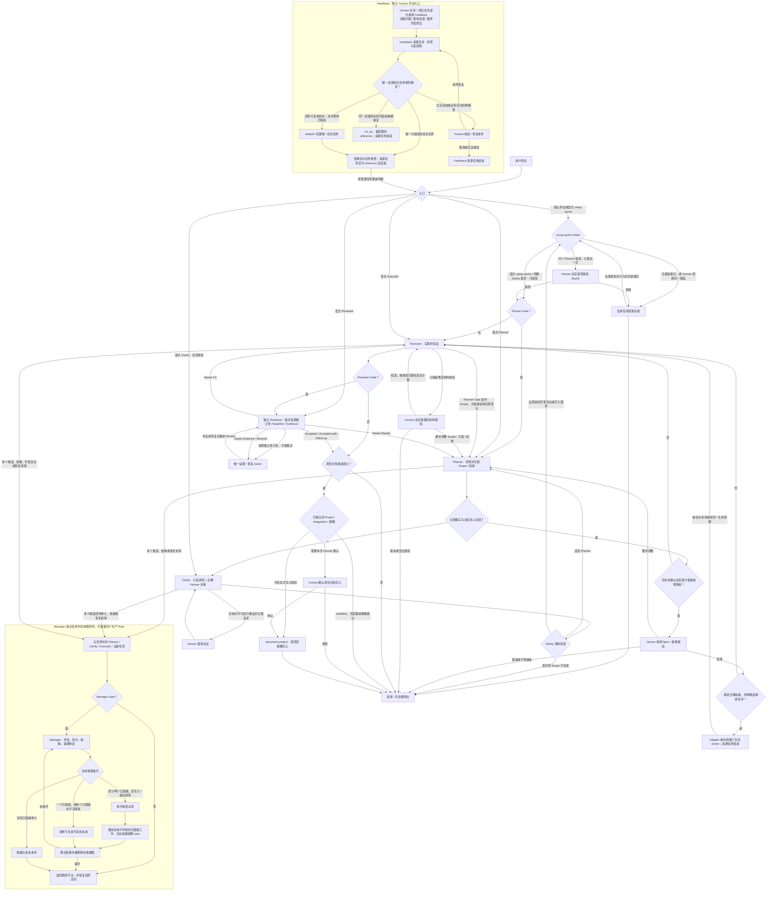

# Sacha Orchestra 插件顶层设计

本文与仓库根 `AGENTS.md` 并列，是供插件开发与评审阶段的 AI 和 Human 共同读取的顶层设计权威，保存产品入口、流程骨架、Role/Skill 职责和 Core owner。它不复制 Runtime 细节，不随插件发布，也不是任务执行依赖。

本文沿用 [Workflow Contract](plugins/sacha-orchestra/core/workflow-contract.md) 定义的“主任务”，以及 [Coordination Contract](plugins/sacha-orchestra/core/coordination-contract.md) 定义的“单层派发”“委派 Agent”和“协调请求”。

## 1. Core 与 Runtime Owner

| Owner | 负责 | 不负责 |
| --- | --- | --- |
| [Intake Contract](plugins/sacha-orchestra/core/intake-contract.md) | 入口分类、接受/拒绝、重复抑制与入口授权 | 接受后的流程、Review、协调、Runtime transport |
| [Workflow Contract](plugins/sacha-orchestra/core/workflow-contract.md) | 唯一 Runtime 生命周期；Role/Gate、节点进入/退出、Human 路由与收尾 | 就绪判定/派发、Review 证据、Artifact、模型参数 |
| [Human Interaction Contract](plugins/sacha-orchestra/core/human-interaction-contract.md) | Human 可见提问、进度、结果顺序与必须披露的信息 | 流程路由、授权结果、Role procedure、Runtime 工具参数 |
| [Assurance Contract](plugins/sacha-orchestra/core/assurance-contract.md) | Baseline、A/B/C 验收、Outcome 与 re-review | Reviewer Gate、实现 procedure、transport |
| [Coordination Contract](plugins/sacha-orchestra/core/coordination-contract.md) | 评估、拆分、依赖/就绪判定、派发/wait/返回、单一写入者、身份/去重与 owner 转移 | Manager Gate、Role 职责、具体模型/工具参数 |
| [Artifact Protocol](plugins/sacha-orchestra/core/artifact-protocol.md) | Artifact 权威、渐进生成条件、Handoff 与恢复语义 | 流程路由、保存路径、原始事实 |
| [Codex Adapter](plugins/sacha-orchestra/adapters/codex/runtime-adapter.md) / [Claude Code Adapter](plugins/sacha-orchestra/adapters/claudecode/runtime-adapter.md) / [Cursor Adapter](plugins/sacha-orchestra/adapters/cursor/runtime-adapter.md) | 单 Runtime 传输、参数、回退、恢复与证据映射 | Gate、就绪判定、Role 和通用流程 |

Skill 内的 `scripts/assets/references` 只实现该 Skill 已声明的能力。`scripts/pi_once.ps1` 与 `scripts/pi_guard.mjs` 是保留但未接入当前 Skill/Adapter 的兼容资产，不属于 active Runtime surface；重新接入前必须先修改本文并取得 Human 批准。Deployment manifest 与 marketplace manifest 只保存版本、部署身份和插件入口，不拥有流程语义。

## 2. 产品入口

- `using-sacha` 是唯一默认入口；清晰且授权完整的任务保持 Direct。
- Planner、Executor、Reviewer 是三个生产 Role，也是高级直接入口；Clarify 是主工作流唯一显式支持入口。
- Manager 只能由主任务在 Manager Gate 打开后调用；document-project 只能由收尾候选路由，二者不是用户入口。
- Feedback 只由 Human 在另一个真实任务手动调用，可提交流程问题、使用反馈或插件开发想法。调用本身授权来源任务有界只读调查并转移 owner；来源任务交付唯一目标任务 reference 后结束，目标任务作为普通任务重新进入通用流程。
- setup-project、setup-agents 是主流程外的显式配置能力，不进入主工作流。

## 3. 流程骨架

### 图的判读规则

- 节点和有向边穷尽顶层产品流转；边文字与节点进入条件定义流转性质。没有边就不能跨节点接管。
- Manager 是可重入的调用—返回函数：进入和退出保留调用节点，生命周期 owner 不变。Handoff 只在迁移、owner transfer 或有恢复消费者时按需携带，不是节点或终态。
- 只有主任务拥有派发权，并执行 Coordination Contract 定义的单层派发；委派 Agent 需要额外拆分或协调时返回协调请求。迁移完成后派发权随工作流 Owner 转移。
- 所有任务优先复用通用入口、Gate、Role、协调和收尾。加速靠关闭无事实 Gate、跳过不成立候选和不加载无消费者 owner，不靠增加特殊流程。
- 新增特殊节点、旁路、专属目标任务限制或例外流转前，必须向 Human 说明真实失败、通用流程为何不足和影响，并取得明确批准。

## 4. Role 职责设计

| Role | 稳定职责 | 局部流程 | 明确不拥有 |
| --- | --- | --- | --- |
| Planner | 把已核实事实和 Human 决定冻结成可执行 Scope、约束与验收 | 核对入口/Gate → 调查或 Clarify → 冻结 Spec/验收 → 必要 Human 批准 → 返回 owner | 生产实施、协调算法、独立裁决、授权替代 |
| Executor | 在明确目标或批准 Scope 内实施、验证并交付真实变更/证据 | 核对 Scope/授权 → 主任务做必要 Manager 协调，或委派 Agent 返回协调请求 → 实施/集成 → 风险对应验证 → Review/收尾 | 冻结新方案、跨单元协调、独立 Review、项目文档 owner |
| Reviewer | 以独立来源对照 Scope、Baseline、实现和原始证据裁决 | 核对 Gate/来源独立性 → 建立 Baseline → 重跑关键验证 → Outcome → 必要时重新 Review | 参与方案/实现、默认修复、创造新 Outcome/旁路 |

Role Skill 必须自包含本行职责、局部流程和边界。修改 Skill 前先判断 delta：

- 只改变职责内 procedure、证据读取方式或表达，可直接修改该 Skill 及唯一 Core/Adapter owner。
- 新增职责、输出类型、跨节点路线、Human 决定点或接管其他 owner，属于顶层设计变化；先改本文并取得需要的 Human 批准，再改 Runtime 合同和 Skill。

## 5. 支持、控制与工具 Skill 能力设计

当前 `skills/*` 共 10 个 Skill：三个生产 Role 已在第 4 节穷尽，其他七个 Skill 在下表穷尽。新增 Skill 必须先在对应表中声明类型、能力和边界，不能先落目录再反推顶层设计。

| 类型 | Skill | 功能/能力 | 局部流程 | 入口/副作用边界 |
| --- | --- | --- | --- | --- |
| 默认入口 | using-sacha | 判断 Direct 或进入 Sacha | 核对 Intake → Direct 或一次候选提议 → Human 接受后交给 Workflow | 不拆分、派发、实施、验收或扩大授权 |
| 支持节点 | clarify | 补齐会改变方案的事实与 Human 决定 | 先查可得事实 → 只问不可推出的决定 → 记录必要锚点 → 返回调用节点 | 显式调用或活跃 Planner 调用；只读，不冻结 Scope |
| 控制面 | manager | 调用后返回的协调控制面 | 评估/拆分 → 依赖/就绪判定 → 串行或单层派发 → 依赖屏障 wait → 聚合/返回 | 仅主任务 + Gate；不成为委派 Agent、生产 Role 或用户入口 |
| 独立支持入口 | feedback | 把具体的流程问题、使用反馈或插件开发想法单向移交给唯一反馈目标任务 | Human 在另一真实任务手动调用 → 有界只读调查 → 查询、复用或创建唯一目标任务 → 交付 reference 后结束 | 调用只授权来源任务调查和转移，不授权目标任务写入或外部动作；目标任务回普通 Intake |
| 内部写入者 | document-project | 按项目策略生成收尾文档或维护 Context | 候选 → 策略/授权 → 选模板/生成 → 验证/报告 | 仅收尾路由；不替代 Artifact 或改变 Review |
| 工具/配置 | setup-project | 生成或刷新 Project Integration、Capability Binding、存储/文档策略与可选兼容配置 | 显式 project root/policy → 解析 provider/Skill → dry-run delta → 无未决变化时以当前 delta 写入 → 原子验证/回滚 | 主流程外；只写批准项目配置，不执行项目任务或配置用户 Agent；保留 Pi model binding 不代表当前 Adapter 会执行 Pi one-shot |
| 工具/配置 | setup-agents | 创建、更新或核对 Sacha-owned Codex Agent definitions | 显式目标 → 解析 creator/runtime → dry-run → namespaced 原子写入/补偿验证 | 主流程外；只管理 Sacha-owned 用户配置，不派发 Agent，也不证明 Runtime discovery |

支持/控制 Skill 的迭代可修改已声明功能内的局部做法。新增功能、入口、外部副作用或跨节点接管，先改本文；不能以“只是补一步”绕过顶层设计。

## 6. 自上而下的变更顺序

1. 写清需求不变量、真实 failure mode、授权和验收；判断是否改变顶层设计。
2. 若改变入口、节点、连线、Role/Skill 职责或特殊流程，先修改本文并取得适用的 Human 批准。
3. 按第 1 节确定唯一 Core owner：流程连线变化先修改 Workflow Contract；跨节点 Human 可见交互修改 Human Interaction Contract；其他局部判断只修改受影响的 Intake、Assurance、Coordination 或 Artifact owner。
4. 修改直接消费该判断的 Role/支持 Skill；只在职责内完善 procedure。
5. 修改受影响 Runtime Adapter、metadata/manifest；长期或 breaking boundary 变化才更新 Evolution。
6. 用 owner review 核对本文与 Runtime 合同，再运行真实 task-package scenario；执行 Agent 不读取本文，独立 evaluator 才用本文判断 drift。

没有顶层变化时，不为“同步”触碰本文；发现下游需要新增图外路线或职责时，停止下游补丁并返回第 1 步。
