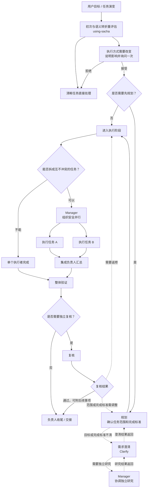
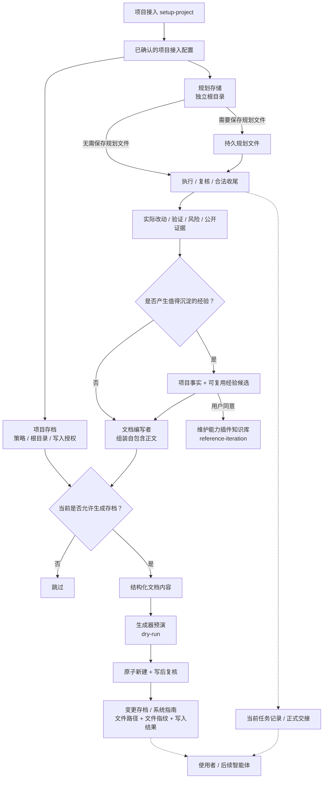

# Sacha Orchestra

跨运行环境的项目工作流插件。Git 发布版本、源码候选和验证层级以[版本演进](../../docs/architecture/evolution.md)为唯一权威。

## 唯一默认入口

直接调用 `$sacha-orchestra:using-sacha`，或让运行环境在初次接收任务及 Direct 执行中的语义转折点重新判断。清晰任务直接执行；只有预计需要关键澄清、先冻结/持久化 Spec、跨 context owner/恢复、难回退跨 owner 决策、正式协调或独立复核会实质改变执行方式时才建议进入 Sacha。同一 candidate 只询问一次；复杂、耗时、多文件或多平台本身不触发。

实线是默认处理流程，虚线是按需辅助或返修。单个有界 helper 由当前 owner 直接管理；多个独立单元才交给 Manager。共享工作树不并行写同一文件，隔离 patch/候选实现可并行并由集成负责人串行应用；Git 和整体验证仍串行。详细进入条件见[入口规则](core/intake-contract.md)和[工作流规则](core/workflow-contract.md)，复核见[验收规则](core/assurance-contract.md)，任务协调见[协调规则](core/coordination-contract.md)。

高级用户可直接调用 `planner`、`executor`、`reviewer`、`manager` 或 `feedback`；这表示同意使用 Sacha，但不会扩大写入、安装、Git 或发布授权。显式 `feedback` 在修复 owner 唯一时会创建或复用其真实 workspace task并等待终态，不以 Source-local 调查 helper 或报告代替。`clarify` 与 `setup-project` 只在明确调用时运行。正式跨 context dispatch 由目标 Runtime Adapter 按 Role、风险和能力选择模型；Codex 还可把低返工、自包含工作交给本地 Pi 单次执行，具体型号由 setup-project 巡检后保存在项目内，未配置则使用 Pi 默认值。具体映射见 [Codex](adapters/codex/runtime-adapter.md) 与 [Claude Code](adapters/claudecode/runtime-adapter.md)。

## 项目接入与运行环境

`setup-project` 先预演改动；无 provider catalog 的项目 Skill 只有在完整正文证明可独立调用、当前 Runtime 可见且依赖成立后，才成为待确认的 capability mapping。确认选择并核对预期文件指纹后，它以回滚保护生成项目接入配置；`project-documentation` 根据已确认的策略输出自包含的变更存档或系统指南，不替代正式任务记录。项目命令和领域规则仍由项目规则与领域能力所有。

规划文件和项目存档可以放在不同目录。`experience.extract` 只返回事实与候选，再由当前任务整理成项目文档；维护能力插件知识库还需用户同意。生成器只安全新建单份文档，不创建目录、覆盖旧文件、更新索引或执行 Git/wiki 发布；当前任务仍以正式任务记录和交接为准。

[任务记录与交接协议](core/artifact-protocol.md)定义正式记录；[Codex 运行适配](adapters/codex/runtime-adapter.md)与[Claude Code 运行适配](adapters/claudecode/runtime-adapter.md)定义平台行为。安装、刷新、移除或重新安装必须获得用户明确授权，并用新任务验证插件能被重新发现。

[版本演进](../../docs/architecture/evolution.md)记录当前方向、发布边界与迁移结论。
