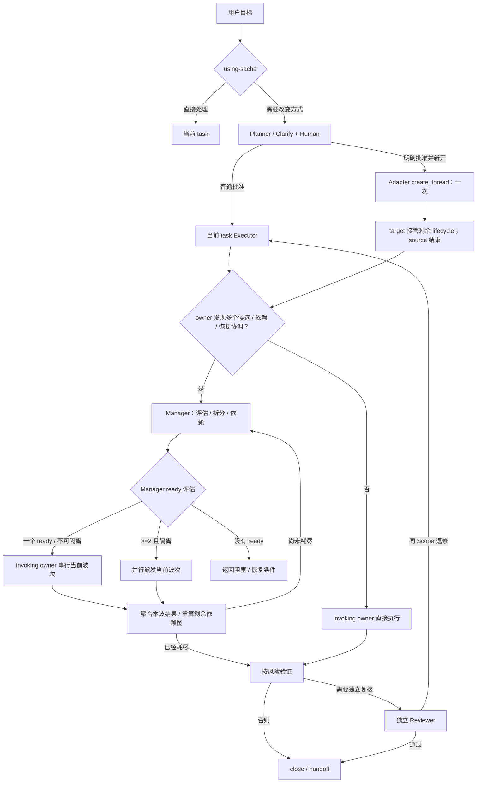

# Sacha Orchestra

跨运行环境的项目工作流插件。Git 发布版本、源码候选和验证层级以[版本演进](../../docs/architecture/evolution.md)为唯一权威；本页只说明用户流程。

## 唯一默认入口

直接调用 `$sacha-orchestra:using-sacha`，或在任务初次接收及语义转折点重评估。清晰任务留在当前 context；只有执行方式会因澄清、持久化批准 Spec、跨 context owner/恢复、正式协调或独立复核而改变时才建议进入 Sacha，同一 candidate 只询问一次。

## 主流程

owner 发现多个候选单元、依赖图或恢复协调时调用 Manager。Manager 是评估、拆分、依赖、ready、派发和归并 owner；串行结论只作用于当前波次，本波结束后重算剩余依赖图。某波次至少两个 execution-ready 或 research-ready 单元且写入隔离时，必须在该波次首次 wait 前实际派发多个实例；没有 ready 时返回阻塞与恢复条件。Git、公共 schema、共享生成物和整体验证由 integration owner 串行。

普通“批准”不创建第二个用户 task，也不再询问开始。只有批准 Spec 已持久化且可达、存在可靠长历史/compaction 事实，并且 Human 明确选择“批准并新开执行任务”时，Codex Adapter 才创建一个 target；target 接管 Execute、subagent、Review、返修与 closeout，旧 task 不等待 return。无可靠 context 信号时不得声称占用过高。

Clarify 只在窄授权内管理自包含、默认只读研究；研究事实回 invoking owner，多个研究单元交同一个 Manager，不跳 Executor。正式 Review 必须使用未参与当前方案/实现的独立 provenance。

## 入口与运行环境

- 高级用户可直接调用 `planner`、`executor`、`reviewer`、`manager`、`feedback` 或显式 `clarify`；不会扩大写入、安装、Git 或发布授权。`setup-project`、`setup-agents` 与安装/刷新/移除/重装都须 Human 明确调用或授权。
- Codex 的 route requirement、首个命中路由、`spawn_agent` 参数、单次 fallback 和 `create_thread` 映射见 [Codex Runtime Adapter](adapters/codex/runtime-adapter.md)；Claude Code 只描述自身 transport。
- 静态文字不证明 Runtime dispatch、安装或 fresh discovery。规范入口：[Intake](core/intake-contract.md)、[Workflow](core/workflow-contract.md)、[Coordination](core/coordination-contract.md)、[Assurance](core/assurance-contract.md)、[Artifact](core/artifact-protocol.md)。
